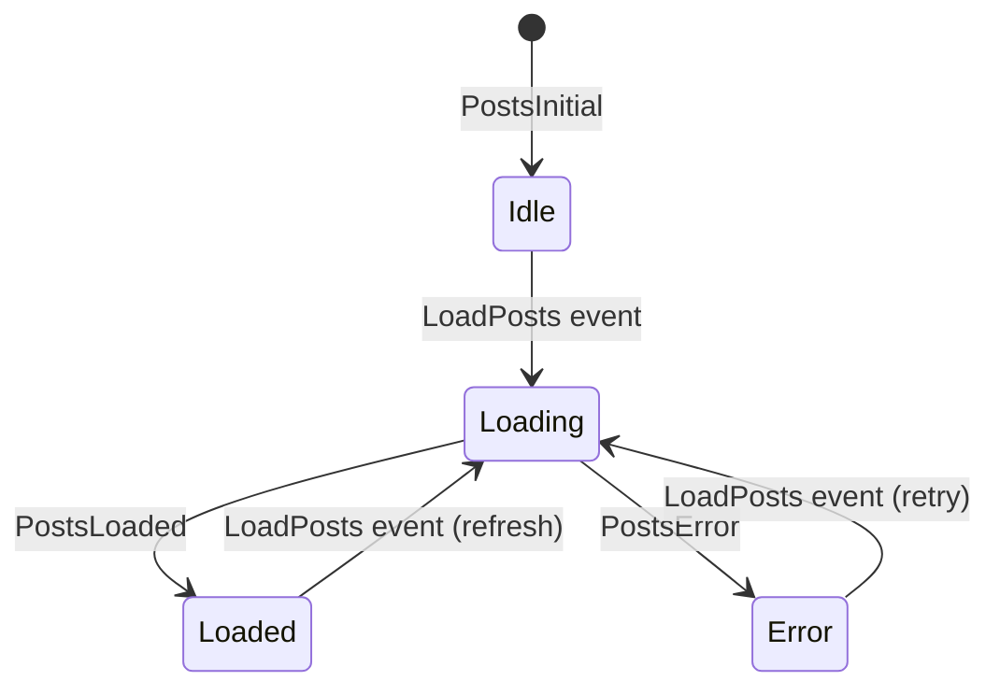
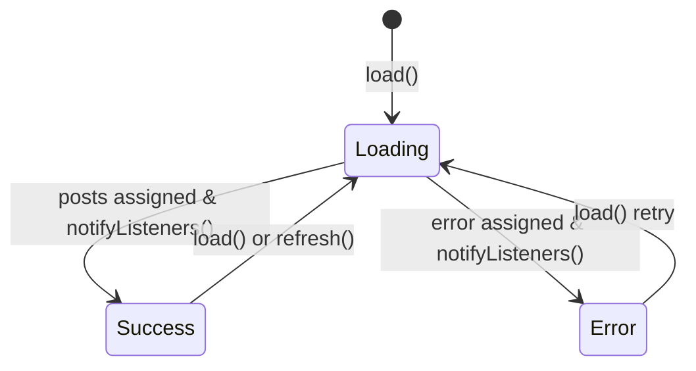
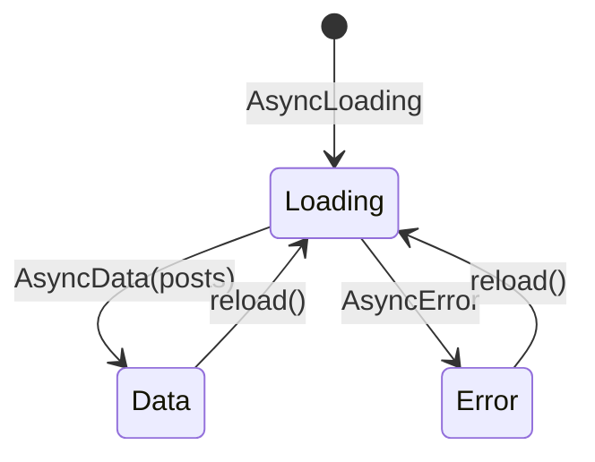

# State Management Approaches

This project demonstrates three different state management libraries side by side. Each tab in the bottom navigation fetches the same posts data from `PostRepository`, but handles loading, success, and error states using a different paradigm.

## Shared Data Layer

- `PostRepository` wraps the Retrofit `ApiClient` and exposes `fetchPosts()` and `fetchPost(id)`.
- All tabs call the same repository methods, which ensures consistent networking behavior and error handling via `NetworkException`.

## Bloc

- Location: `lib/feature/posts/bloc/`
- `PostsBloc`/`PostDetailBloc` respond to events (`LoadPosts`, `LoadPostDetail`) and emit states (`PostsLoading`, `PostsLoaded`, `PostsError`, etc.).
- Widgets (`PostsPageBloc`, `PostDetailPageBloc`) use `BlocBuilder` to rebuild based on `PostsState`/`PostDetailState` values.
- State transitions are explicit: events trigger repository calls, responses become new immutable state objects.

## Provider (ChangeNotifier)

- Location: `lib/feature/posts/provider/`
- `PostsProvider` and `PostDetailProvider` extend `ChangeNotifier` with mutable fields (`isLoading`, `posts`, `error`).
- Pages wrap their subtree in `ChangeNotifierProvider` and use `Consumer` to listen for `notifyListeners()`.
- Loading and error flags are toggled before/after repository calls, and UI branches on those booleans.

## Riverpod (AsyncNotifier)

- Location: `lib/feature/posts/riverpod/`
- `PostsNotifier` extends `AutoDisposeAsyncNotifier<List<Post>>`, returning an `AsyncValue`. `PostDetailNotifier` is a `AutoDisposeFamilyAsyncNotifier<Post, int>`.
- Widgets (`PostsPageRiverpod`, `PostDetailPageRiverpod`) read providers (`ref.watch`) and use `.when` to react to `AsyncValue` states (loading/data/error).
- Refresh and retry actions call `ref.read(...).reload()` to trigger new fetches.

## When to Choose Which

- **Bloc**: Prefer when you need predictable, event-driven state transitions, especially in larger apps with complex flows or when you want time-travel debugging.
- **Provider**: Good for simple mutable models and when you want a minimal dependency with ChangeNotifier semantics.
- **Riverpod**: Offers compile-time safety, testable providers, and declarative `AsyncValue` handling with less boilerplate than Bloc but more structure than vanilla Provider.

Regardless of the approach, the repository layer remains the single source of truth for data fetching, making it easy to swap state libraries while reusing the same API stack.
